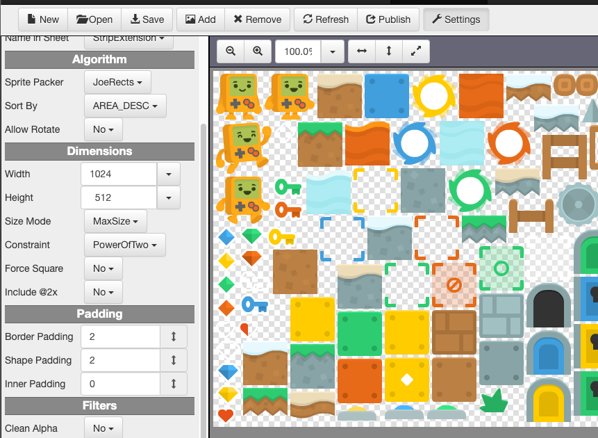

# Sheets

Sheets is one of the apps in the http://gamedevutils.com/ suite of tools. It takes a collection of images and efficiently packs them into a single texture (sprite sheet), along with a mapping file (sprite atlas).



## The Web App and the Desktop App

The web-desk folder contains the logic for both the static web application and the desktop application.

### Build Web

Run the following from the `web-desk` folder to clean and build the web application, which is referenced by the desktop application.

```shell script
$(npm run clean-web) && npm run build-web
```

### Test Web

Run the following from the `web-desk` folder to run the tests.

```shell script
npm run test
```

### Run Web

Run the following from the `web-desk` folder to run the static web application in a local web server, accessible from the `http://localhost:8088/` URL. The web browser should be launched with that address automatically when the script has finished.

```shell script
npm run start8088
```

### Build Desktop

The desktop-specific build script has not been written yet. Building the web application will let you know if your UI/UX is working as expected.

### Test Desktop

The desktop-specific build script has not been written yet.

### Run Desktop

Run the following from the `web-desk` folder to see your web application running as a desktop application.

```shell script
npm run dev
```

> **NOTE:** The desktop application will open with the developers tools showing a warning about packaging the application. Once the application is packaged, this message shouldn't be displayed. Close the developer tools to reveal your desktop application. There is no packaging script at this time.
>